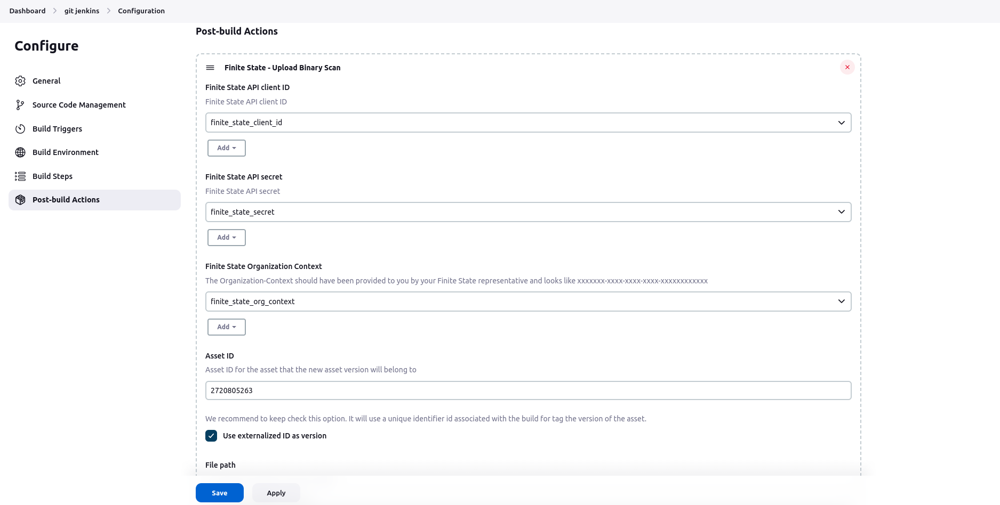
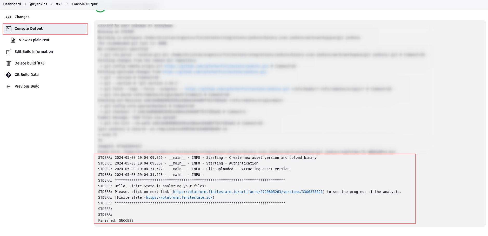

# [Finite State](https://finitestate.io) `binary-scan` plugin for Jenkins

[finitestate.io](https://finitestate.io)

## Introduction

The Finite State `binary-scan` Extension allows you to easily integrate the Finite State Platform into Jenkins.

Following the steps below will:

* Upload the file to the Finite State platform
* Create a new version of the configured asset
* Conduct a Quick Scan binary analysis on the uploaded file
* Associate the results to the asset version

By default, the asset version will be assigned the existing values for Business Unit and Created By User. If you need to change these, you can provide the IDs for them.

This plugin gives you the ability to add a Post Build action for:

- Freestyle projects
- Multi-configuration project

## Getting started

To use this plugin, follow the following steps:
1. [Install the plugin](https://www.jenkins.io/doc/book/managing/plugins/#installing-a-plugin) in you jenkins instance. 
2.  Create or edit your `Frestyle project` or `Multi-configuration poject`.
3. Click on the **Add a Post-build Actions** dropdown and select `Finite State - Upload Binary Scan` option:

4. The **post build action** will be appear in the UI:

5. Complete the fields following the below reference. For sensitive fields like `Finite state API client`, `Finite State API client ID` and `Finite state organization context` we use the credentials plugin, so, be sure to create the credentials for each of this fields and select the correct ones on each dropdown. 

| parameter                         | description                                                                                                                                                                                  | required | type      | default |
| --------------------------------- | -------------------------------------------------------------------------------------------------------------------------------------------------------------------------------------------- | -------- | --------- | ------- |
| Finite state API client            | Finite State API client ID                                                                                                                                                                   | `true`   | `credential`  |         |
| Finite state API secret               | Finite State API secret                                                                                                                                                                      | `true`   | `credential`  |         |
| Finite state organization context | The Organization-Context should have been provided to you by your Finite State representative and looks like `xxxxxxx-xxxx-xxxx-xxxx-xxxxxxxxxxxx`                                           | `true`   | `credential`  |         |
| Asset ID                          | Asset ID for the asset that the new asset version will belong to                                                                                                                             | `true`   | `string`  |         |
| Use externalized ID as version                          | Use an auto generated id to tag the version in Finite state platform. It uses a combination of project name and build number. If this option is checked, the version field does not take any effect.                                                                                                                             | `true`   | `boolean`  |         |
| Version                           | The name of the asset version that will be created (only used if "Use externalized ID as version" is not checked)                                                                                                                                       | `true`   | `string`  |         |
| File path                         | Local path of the file to be uploaded                                                                                                                                                        | `true`   | `string`  |         |
| Quick scan                        | Boolean that uploads the file for quick scan when true. Defaults to true (Quick Scan). For details about the contents of the Quick Scan vs. the Full Scan, please see the API documentation. | `false`  | `boolean` | `true`  |
| Other Optional Configurations: |
| Business unit ID                 | (optional) ID of the business unit that the asset version will belong to. If not provided, the asset version will adopt the existing business unit of the asset.                             | `false`  | `string`  |         |
| Created by user ID                | (optional) ID of the user to be recorded as the 'Created By User' on the asset version. If not provided, the version will adopt the existing value of the asset.                             | `false`  | `string`  |         |
| Product ID                        | (optional) ID of the product that the asset version will belong to. If not provided, the existing product for the asset will be used, if applicable.                                         | `false`  | `string`  |         |
| Artifact description              | (optional) Description of the artifact. If not provided, the default is "Firmware Binary".                                                                                                   | `false`  | `string`  |         |
6. Click on **Save** button to save the configuration
7. After **building** the project, the plugin will upload the file to the Finite State Platform. The output will be displayed in the console.

**Note:** Please note that if any errors occur, they will also be displayed on the same screen.

## Issues

Report issues and enhancements in the [Github issue tracker](https://github.com/FiniteStateInc/binary-scan-jenkins/issues).

## Contributing

Refer to our [contribution guidelines](https://github.com/jenkinsci/.github/blob/master/CONTRIBUTING.md)

## LICENSE

Licensed under MIT, see [LICENSE](LICENSE.md)

## Developers Guide

Please follow the steps described [**here**](DeveloperGuide.md)
